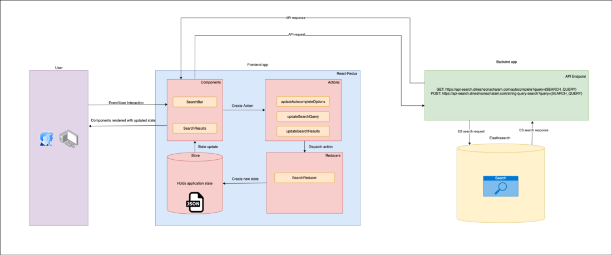
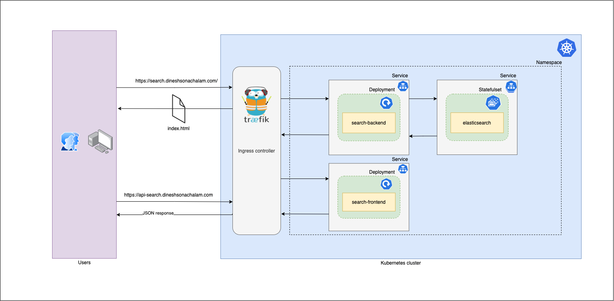

## Elasticsearch

### How data processing before building Index

1. Operation of `Text field` and `Analyzer`
    + Behind the full-text search mechanism, how text processing through `Lucene`
2. Dynamic Mapping practical tips
    + Uniform naming convention -> `dynamic_templates`
    + carefully setting `dynamic templates`
    + ***Turn off*** dynamic fields mapping
      + X ~~`dynamic: false`~~
      + V `dynamic: strick`
    + ***Turn off*** `date` or `number` automatic judgment
3. Index Template
4. Index Alias

### keyword type vs. text datatype

[When to use the keyword type vs. text datatype in Elasticsearch | ObjectRocket](https://kb.objectrocket.com/elasticsearch/when-to-use-the-keyword-type-vs-text-datatype-in-elasticsearch)

### Ref

+ [Elasticsearch Index 管理與效能優化技巧 - YouTube](https://www.youtube.com/watch?v=dVUMqi5knuo)

## Kibana

Kibana is a free and open user interface that lets you visualize your Elasticsearch data and navigate the Elastic Stack. Do anything from tracking query load to understanding how requests flow through your apps.

+ UI Dashboard
+ Widgets / Visualization

## Logstash

+ Input / Transform /stash

## Application Architecture

